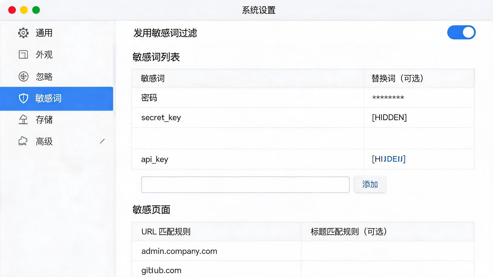

# Maccy Sensitive Words - 敏感词脱敏增强版

基于 [Maccy](https://github.com/p0deje/Maccy) 开源项目的增强版本，在保留原有所有功能的基础上，新增了敏感词自动脱敏/还原功能。

## 原项目

- **原项目地址**: [https://github.com/p0deje/Maccy](https://github.com/p0deje/Maccy)
- **原项目官网**: [https://maccy.app](https://maccy.app)
- **原项目说明**: Maccy 是一款轻量级的 macOS 剪贴板管理器，用于保存复制历史并支持快速搜索和使用。

## 新增功能

### 敏感词自动脱敏（可还原）



在原项目基础上，本版本新增了以下功能：

#### 1. 自动编码脱敏（可还原）
- 使用 **Base64 编码** 格式进行脱敏，格式为 `__MACCY_B64_<base64>__`
- 与其他文本**零冲突**，包含唯一前缀标识
- **完全可还原**，脱敏后可精确恢复原文
- 支持中英文及特殊字符

#### 2. 两种脱敏模式
| 模式 | 可还原 | 说明 |
|------|--------|------|
| **自动编码** (推荐) | ✅ | Base64 编码，可完全还原 |
| **星号掩码** | ❌ | 视觉隐藏，不可还原 |
| **自定义替换词** | ✅ | 用户指定替换词，可还原 |

#### 3. 多应用支持
支持检测以下应用的页面信息：
- 🌐 **浏览器**: Chrome、Edge、Brave、Arc、Safari
- 🤖 **AI 编程工具**: Codex、Cursor、VS Code
- 🔧 **开发工具**: iTerm2、Figma

#### 4. 默认 AI 网页配置
预置 13 个主流 AI Chat 网页作为敏感页面：
- ChatGPT (chat.openai.com, chatgpt.com)
- Claude AI (claude.ai)
- Gemini (gemini.google.com)
- Perplexity (perplexity.ai)
- Mistral (mistral.ai)
- xAI/Grok (x.ai)
- Character.AI (character.ai)
- Poe (poe.com)
- Anthropic Console (console.anthropic.com)
- Google AI Studio (aistudio.google.com)
- 等...

## 工作原理

### 脱敏流程（粘贴到敏感页面）
1. 用户从 Maccy 历史选择内容
2. WindowObserver 检测目标页面是否为敏感页
3. 如果是敏感页面：敏感词 → Base64 编码 → 脱敏后内容写入剪贴板
4. 如果不是敏感页面：原文直接写入剪贴板

### 还原流程（从敏感页面复制）
1. 用户在敏感页面复制内容
2. Maccy 监听剪贴板变化
3. WindowObserver 检测源页面是否为敏感页
4. 如果是敏感页面：解码 Base64 编码 → 原文存入 Maccy 历史
5. 如果不是敏感页面：原文直接存入 Maccy 历史

## 使用方法

1. 打开 Maccy 设置（`⌘,`）
2. 切换到"敏感词"面板（盾牌图标）
3. 配置脱敏方式：
   - ✅ 推荐：自动编码（可还原）
   - ⚠️ 可选：星号掩码（不可还原）
4. 勾选需要监控的应用
5. 添加敏感词和可选的自定义替换词
6. 加载 AI 网页默认配置（一键添加主流 AI 平台）
7. 添加自定义敏感页面规则
8. 配置完成后自动生效

## 脱敏示例

### 自动编码模式
```
原词: password
脱敏: __MACCY_B64_cGFzc3dvcmQ=__
还原: password  ✅
```

### 自定义替换词模式
```
原词: password
替换词: [REDACTED]
脱敏: [REDACTED]
还原: password  ✅
```

### 星号掩码模式
```
原词: password
脱敏: p**d
还原: ❌ 无法还原
```

## 技术实现

### 新增文件
- `Maccy/SensitiveWordConfig.swift` - 敏感词配置模型（脱敏/还原核心逻辑）
- `Maccy/WindowObserver.swift` - 多应用窗口观察者，支持浏览器和 IDE
- `Maccy/Settings/SensitiveWordsSettingsPane.swift` - 敏感词设置页面 UI

### 修改文件
- `Maccy/Clipboard.swift` - 集成新的 WindowObserver
- `Maccy/AppDelegate.swift` - 初始化 WindowObserver
- `Maccy/Extensions/Defaults.Keys+Names.swift` - 添加敏感词配置存储键
- `Maccy/Extensions/Settings.PaneIdentifier+Panes.swift` - 注册敏感词设置面板
- 本地化字符串文件 - 更新中英文 UI 文案

### 核心数据模型
```swift
// 敏感词
struct SensitiveWord {
    var word: String              // 原始敏感词
    var replacement: String?      // 自定义替换词（nil=自动编码）
}

// 敏感页面
struct SensitivePage {
    var urlPattern: String        // URL 匹配模式
    var titlePattern: String?     // 标题匹配模式
    var note: String?             // 备注
}

// 支持的应用
struct SupportedApp {
    var bundleID: String          // macOS bundle identifier
    var name: String              // 显示名称
    var enabled: Bool             // 是否启用
}
```

## 测试结果

✅ **18/18 测试全部通过**

| 测试场景 | 结果 |
|---------|------|
| 自动编码脱敏/还原 | ✅ |
| 多敏感词处理 | ✅ |
| 中文支持 | ✅ |
| 星号掩码（不可还原） | ✅ |
| 自定义替换词 | ✅ |
| 混合模式（自动+自定义） | ✅ |
| 默认 AI 页面识别 | ✅ |
| 边界条件 | ✅ |
| 特殊字符处理 | ✅ |

## 许可证

MIT License - 与原项目保持一致
